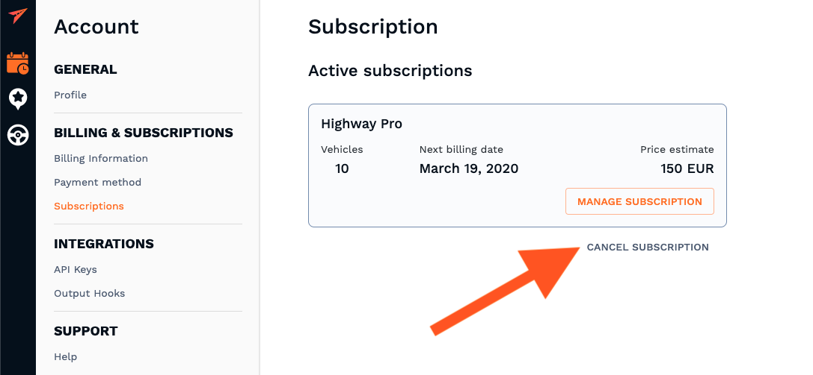

## Cancel future payments

**Trials**: It is not necessary to cancel a trial account. If a 14-day trial expires and you do not choose a plan your credit card will not be charged since we don't ask for that information upfront.

**Active Plans**: To request the cancellation of your account, simply click "Cancel Subscription" and our support team will cancel your account and provide confirmation via your admin email address.

