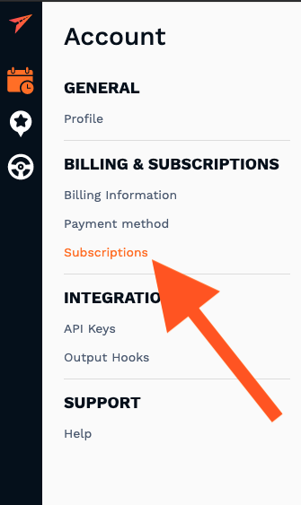
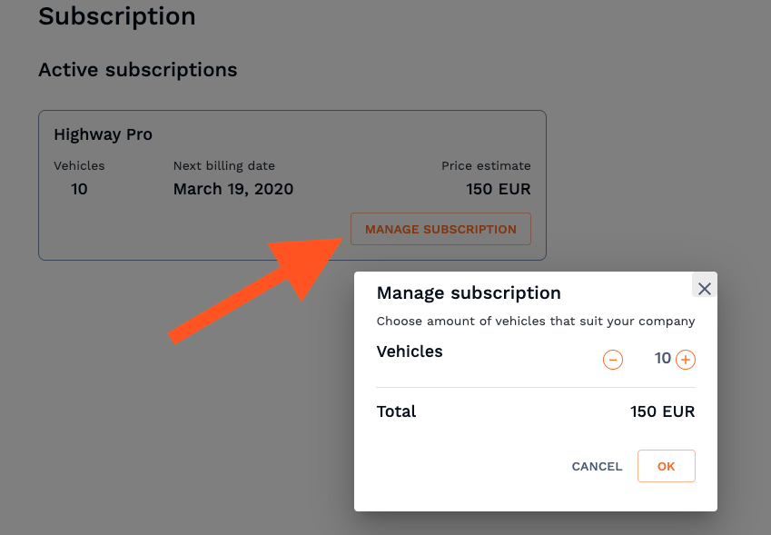

## Current billing plan

You can view your current plan in the Subscribtions tab in your account's dashboard settings which you can access in the bottom left corner of the screen. You will also be able to see how many vehicles you currently have added in the susyem, price estimate and next billing date.

To change the amount of vehicles you plan on using with Highway simply click "Manage Subscription" button. 

