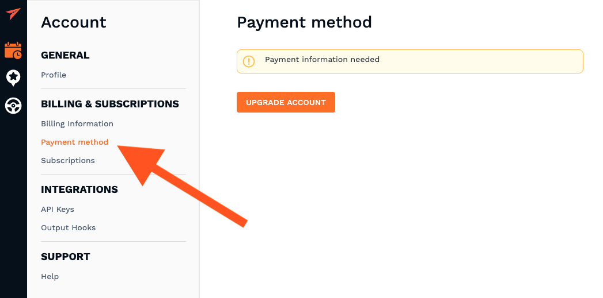
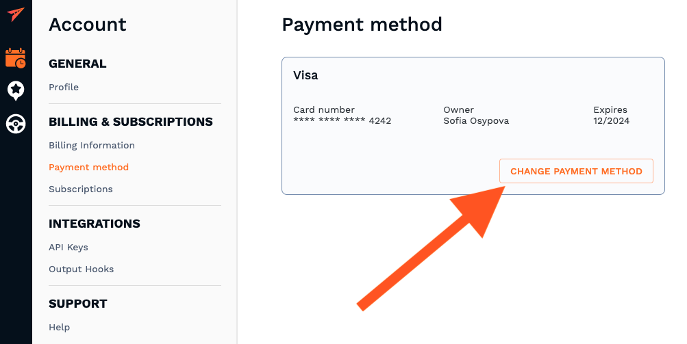

## Update payment information

If you need to add your credit card, you can do so by clicking the "Upgrade Account" button under the payment method section of the Billing & Subscriptions tab in your accounts's dashboard settings.

If you already provided your payment method and wish to change it please click "Change Payment Method" button in payment method section.

