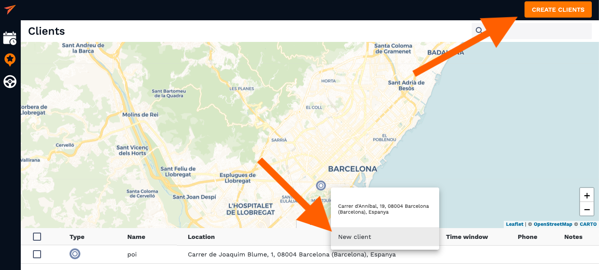
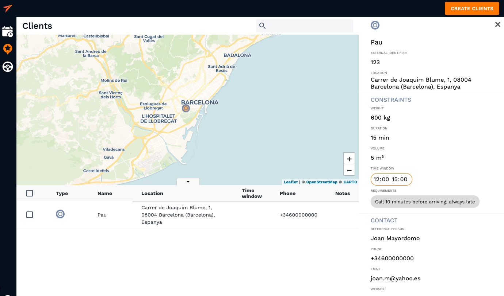
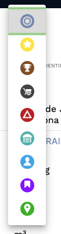
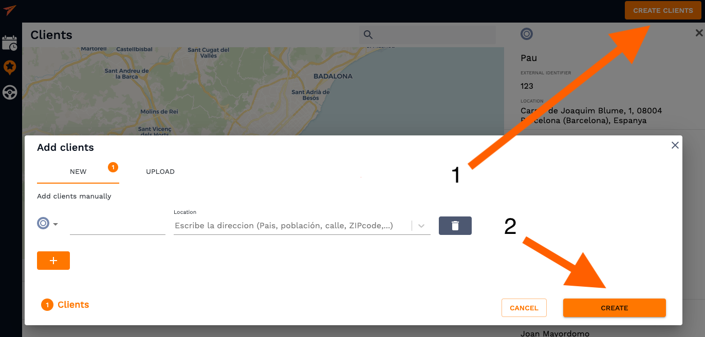

# Save clients

**Add your customer information to the system for future orders and save even more time while planning**

## Essentials

This guide describes how to create, edit and save your customers through the API. But, first of all it is necessary to provide a client definition:

- **Client** is a set of parameters (contact, constrains, location, ...), that would represent a point on the map. Tasks are represented by clients.
  These tasks must be assigned to someone (courier, driver, ...) formerly called **Route**.

<!-- tabs:start -->
#### ** Customer **

##  Add a client

To add a client you have to enter the **Plans** section or the **Clients** section. 
Saving clients can be as easy as right-clicking a map at clients address and a pop-up will suggest to save this address as a new service which can be assigned throught client or a vehicle as well as through a button in the top right corner. 

The client information that you can save includes client location and external identifier, constrains and contact information. The profile of a client should look something like this:

You can specify a wide range of constrains which include **volume, weight, time windows, usual delivery duration and even requirements field where you can leave a note for convinience**. Also, clients can be pin-pointed on the map with different icons in order to represent different types of businesses and locate them on the map faster. Just left-click the default grey icon to change its appearance. 

Clients can be added manually by clicking the "Create Clients" button (1) and then after the input has been done by hitting "Create" button (2) or can be imported from an excel sheet which will be explained step-by-step in the [uploading a spreadsheet](/clients/uploading_excel.md) section. 

#### ** Developer **

<!-- tabs:end -->

## See also

This guide provides a Quickstart in the clients module. Now you know how to create a client and how to add all the required constrains to match it with services and routes in a most efficient way.
But, why stopping here? The best part is about to come.

- [Uploading a spreadsheet]()

