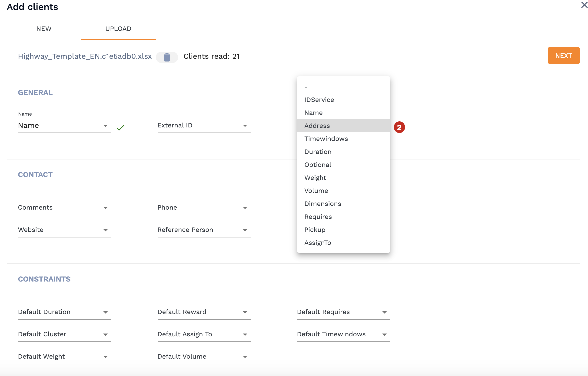
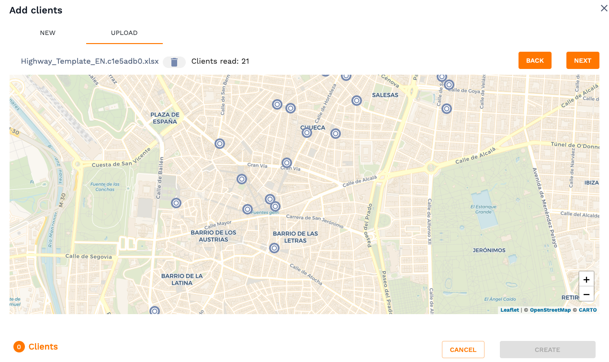
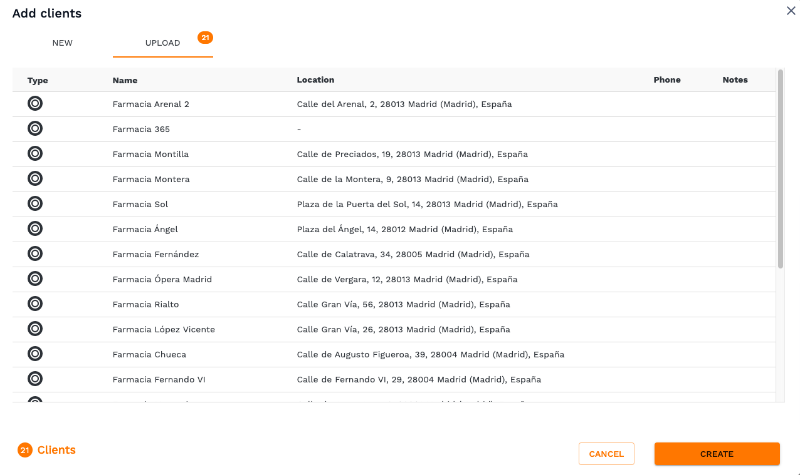
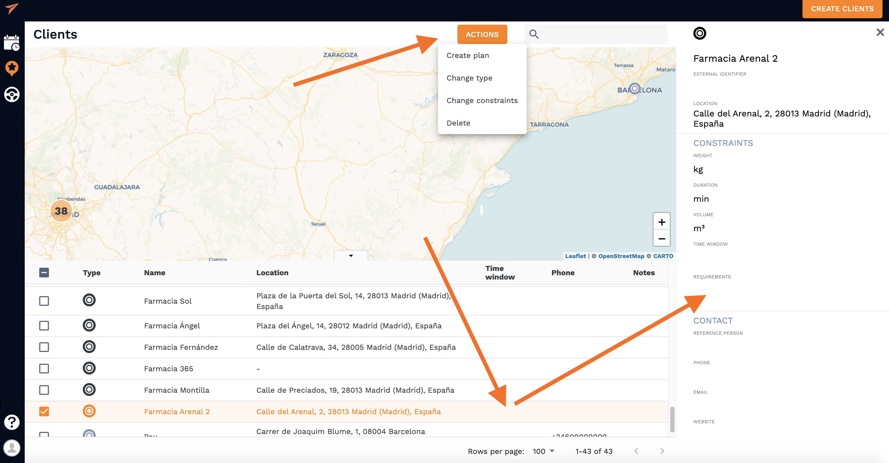

# Upload an excel sheet with your operations 

**Import your clients from an shreadsheet just in few moments**

<!-- tabs:start -->
#### ** Customer **

## 1. Uploading an excel sheet 

To start uploading clients from a spreadsheet navigate to "Upload" bar in the "Create Clients" section, choose a file and upload it. Once the file is uploaded next thing to do is to **allow the columns with client information you have in your spreadsheet to be read by the system**. You need to choose the relevant parameters in the drop-down menu that would match the column names in your excel sheet. In the example below, we only wanted to import address and name of the client:

Click "Next" button to continue after picking all the parameters. 

## 2. Map your clients

Next, you will see a map layout with all the saved client locations which will look something like this:  

Click "Next" button to continue the upload. 

**NOTE**: It will look like this if all read locations are relatively close, more further locations will make the map zoom out to capture all the locations

## 3. Check the data 

Before final client upload to the system you can view the information one last time in a form of a list to check if your excel was read properly. If that's the case - hit "Create" button and you're almost there. 

## 4. Make any adjustment if needed

The clients have been successfully uploaded and now you can adjust the client list as you want. You can check the clients you want to do same actions with and hit "Actions" button at the top of the nativation bar and choose what needs to be done to all of them. Also, you can click on any particular client and manually change information in his profile. 

Client icons appearance can be adjusted in order to specify the type of business or for own client categorization which is explained in section [adding a client](/clients/creating_clients.md). 

#### ** Developer **

<!-- tabs:end -->

## FAQs

- Why my columns headers weren't read properly? 
  
  - When you upload an excel file with multiple sheets, the system is **_always reading the first one_**. You can find more information on how to upload files with multiple worksheets [here](/vehicles/other_sheets.md).

- What does the red symbol on the right of the column mean? 

 - If you see this symbol when trying to upload a spreadsheet it means that the column data wasn't read properly and no value will be assigned to that parameter. 

 

 If you see that error message, please check if you selected the right column header. If the header is correct, check if the data format is correct. Correct data format for service upload should look like this: 

 **Service address**: You can enter it using coordinates like: **“latitude, longitude“**. Or you can enter the client’s address: recommended order **“street name, number, ZIP code, town or city, country”**.

 **Time window**: You can enter more than one time window in this way **“8:00-9:00; 11:00-12:00“**.

 **Duration**: How long will the vehicle be stopped in minutes.
  

## See also

This guide provides a Quickstart in the clients module. Now you know how to save a client and how to add all the required constrains to match it with services and routes in a most efficient way.
But, why stopping here? The best part is about to come.

- [Adding a client](/clients/creating_clients.md)
- [Using multiple sheets](/clients/cother_sheets.md)