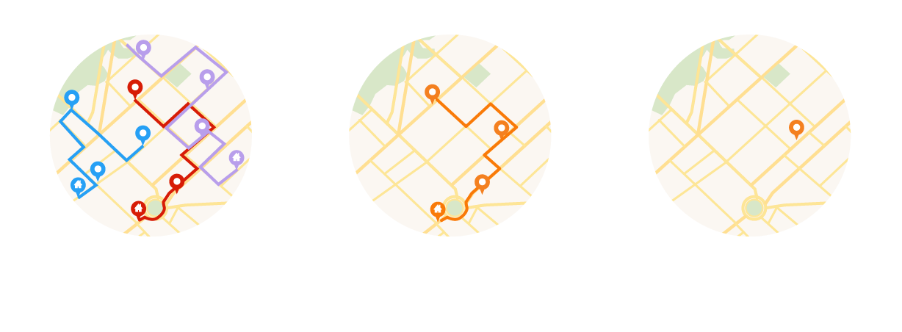
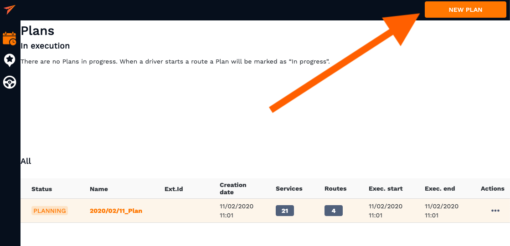
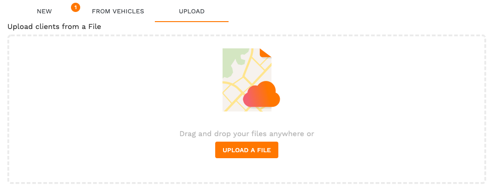
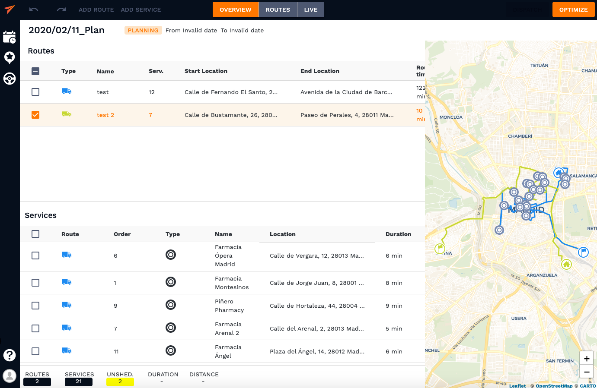
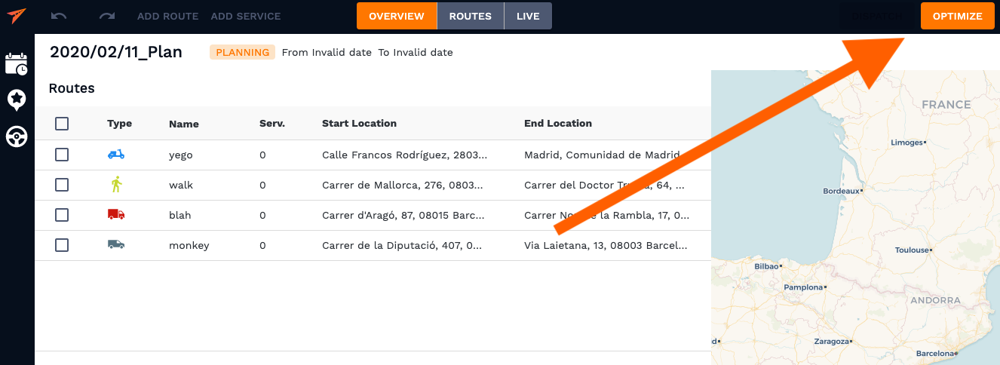
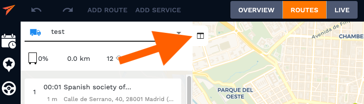
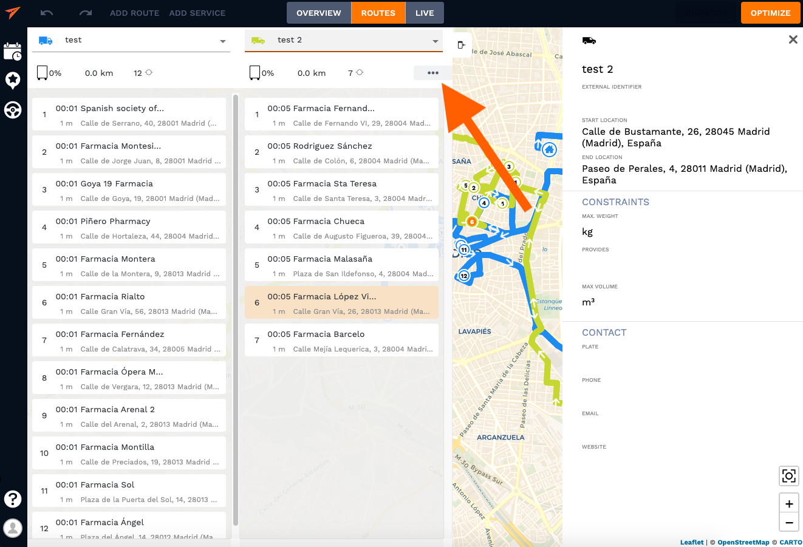

# Set up a plan

**Learn to create new plans from scratch and how to use their superpowers**

## Essentials

This guide describes how to create, edit and optimize a plan through the API. But, first of all it is necessary to
provide some definitions:

- **Plan** is a set of tasks (deliveries, pickups, repairs, ...), formerly called **Services**, that must be done within a time interval.
  These tasks must be assigned to someone (courier, driver, ...) formerly called **Route**

- **Route** is a set of services that must be performed by the same entity (courier, driver, ...) within a certain order.

- **Service** is a task that must be performed. It's defined by it's location and may contain some constraints such as _duration_, _timewindows_, ...



<!-- tabs:start -->
#### ** Customer **
## 1. Set up Highway

Follow the step from our user manual for developers to start getting benefits from optimizing your routes. With Highway you can build up your entire fleet of any types of vehicles for both small deliveries and heavy duty equipment. Our software helps our customers manage, organize and coordinate their routes and services all in one place. Highway offers a wide range of restrictions that can be set by a that will make your planning as accurate as it gets. It can easily adjust to your specific use case or unique business model as well as import vehicles from a telematics service of your choice in case you already have one. In the next section you will learn more about how to modify the details of your services as well as assign vehicles to the routes and much more. 


## 2. Create a plan

To create a new vehicle in Highway you should start with going to "Plans" section and hit a "New Plan" button. 



## 3. Create services and routes

Next you will see "Add Route" and "Add Service" in the top left corner of the interface, go ahead and click on one of those. 


You can add information manually, import it from previously saves clients or vehicles or, most likely, you would want to import your usual excel sheet straight in the system. 



After that is done, you want to choose general and contact information as well as constrains you have in your shreadsheet and match them with the one offered by the platfrom. This includes volumetric restrictions, timewindows, duration of delivery, service ID, assignee, etc. Save those changes and hit "Next", "Next" again after you chacked that the input is correct and then "Create" to view the final screen before the start of optimization. You should see a window where you would have at least one route and at least one service for the "Optimize" button to appeat clickable. 



Apart from services and routes, vehicles and clients can also be added to the system. It's very convinient if you do business with the same clients over and over again. 

Creating clients can be as easy as right-clicking a map at clients address and a pop-up will suggest to save this address as a new client as well as through a button in the top right corner. 


## 4. Optimizing the route

At this point you need to click the optimize button in the top right corner.

 

Now you can view your optimized routes and adjust them according to your specific requirements if needed. In the "Routes" tab on the navigation bar you can view how the system merged routes and services and distributed tasks between all the vehicles. 

Highway interface allows users to view two task lists of two vehicles at a time in order to adjust them using a convinient drag and drop gesture. You can keep on adding services and routes again and again until you're satisfied with the result. 



**NOTE**: When you want to reoptimize a manually adjusted route for a specific vehicle without losing changes, you should click a "Reoptimize Route" instead of "Optimize" button which you can find in the customization bar marked with three dots in the top right corner of task list of every vehicle in the fleet. 



#### ** Developer **
## 1. Set up Highway

The first thing needed is the user's `private_key`. This key is needed to authenticate every single request performed against the Highway API.

You can find the private key under the [user settings](https://highway.smartmonkey.io/highway/account/keys). Private keys will always start with the preffix `priv_` for
users clarity.


## 2. Create a plan

The plan is a container for routes and services. It is usually defined by a start date. It is necessary to have a plan to start optimizing and to be able to track
the progress of operations.

```bash
curl "https://highwayservices.smartmonkey.io/api/v1/plan\
?private_key=priv_zWBZEPmNc9phMQ9oQ-Q0eSuD~UY4pMcfTZ4rWZ4SWVAnTsiUkUsTiTvJmJHc.Joa" \
  -d label="Example Highway Plan" \
  -d external_id="my-database-id" \
  -d start_date="2020-01-01"
```

This returns a `Plan` object.

```json
{
  "id": "5e20672d9e1ae762f27a7602",
  "user_id": "5e05f3c71a693d1ab5282392",
  "_version": 1,
  "external_id": "my-database-id",
  "created_at": "2020-01-16T13:37:49.041Z",
  "updated_at": "2020-01-16T13:37:49.041Z",
  "start_date": "2020-01-01T00:00:00.000Z",
  "tags": [],
  "status": "planning",
  "label": "Example Highway Plan",
  "services": [],
  "routes": []
}
```

After creating the plan, store the `id` value in your database so you can use it in further steps.

?> **Tip** you can fill the field `external_id` with your database
identifier to add a plus of consistency and enable cross-reference.

## 3. Create services and routes

Creating services and routes requires having a `Plan` previously created. As we now have the `id` of our
plan we can move and send a request for creating a service.

```bash
curl "https://highwayservices.smartmonkey.io/api/v1/service\
?plan_id=5e20672d9e1ae762f27a7602\
&private_key=priv_zWBZEPmNc9phMQ9oQ-Q0eSuD~UY4pMcfTZ4rWZ4SWVAnTsiUkUsTiTvJmJHc.Joa" \
  -d label="My First Service" \
  -d external_id="my-db-service-id" \
  -d duration=3600 \
  -d location='{ "country": "Spain", "city": "Barcelona", "lat": 41.3851197, "lng":2.1706936 }'
```

This will return a `Service` object. This object contains some predefined values such as `optional`. Check out the `Service` model specs for further information.

```json
{
  "id": "5e2067459e1ae762f27a7604",
  "type": "delivery",
  "plan_id": "5e20672d9e1ae762f27a7602",
  "user_id": "5e05f3c71a693d1ab5282392",
  "external_id": "my-db-service-id",
  "created_at": "2020-01-16T13:38:13.700Z",
  "updated_at": "2020-01-16T13:38:13.700Z",
  "location": {
    "country": "Spain",
    "city": "Barcelona",
    "lat": 41.3851197,
    "lng": 2.1706936
  },
  "label": "My First Service",
  "tags": [],
  "duration": 3600,
  "requires": [],
  "optional": true,
  "assign_to": [],
  "timewindows": []
}
```

!> **Important** If the number of services exceeds the user quota, this request will return`highway.subscription.error.services_quota_exceeded` error.

Now we are going to create the first `Route` in a similar way as we did with services.

```bash
curl "https://highwayservices.smartmonkey.io/api/v1/route\
?plan_id=5e20672d9e1ae762f27a7602\
&private_key=priv_zWBZEPmNc9phMQ9oQ-Q0eSuD~UY4pMcfTZ4rWZ4SWVAnTsiUkUsTiTvJmJHc.Joa" \
  -d label="My First Route" \
  -d external_id="my-db-route-id" \
  -d start_location='{ "country": "Spain", "city": "Barcelona", "lat": 41.3851197, "lng":2.1706936 }' \
  -d end_location='{ "country": "Spain", "city": "Barcelona", "lat": 41.3851197, "lng":2.1706936 }' \
  -d timewindow='[25200, 54000]'
```

This will return a `Route` object.

?> **Tip** Notice that the `timewindow` of the vehicle is expressed in seconds from the start of the day, so `07:00:00` should be expressed as the result of _7\*60\*60_ which is `25200`.
This is the notation of time constraints for plans.

?> **Tip** `planned_track` is a the route in a map that the vehicle must follow to achieve all services. The format of this value is a [Polyline](https://developers.google.com/maps/documentation/utilities/polylinealgorithm), the result of an algorithm designed by google to lossy compress series of coordinates.

```json
{
  "id": "5e2067619e1ae762f27a7605",
  "user_id": "5e05f3c71a693d1ab5282392",
  "plan_id": "5e20672d9e1ae762f27a7602",
  "created_at": "2020-01-16T13:38:41.384Z",
  "updated_at": "2020-01-16T13:38:41.384Z",
  "label": "My First Route",
  "timewindow": [25200, 54000],
  "start_location": {
    "country": "Spain",
    "city": "Barcelona",
    "lat": 41.3851197,
    "lng": 2.1706936
  },
  "end_location": {
    "country": "Spain",
    "city": "Barcelona",
    "lat": 41.3851197,
    "lng": 2.1706936
  },
  "provides": [],
  "planned_track": "u_r{F}|fL??",
  "feedback": [],
  "planned_end_time": 25204,
  "planned_start_time": 25200,
  "services": []
}
```

## 4. Optimizing the route

When a plan is optimized, the system automatically assign the plan's services to routes in a certain order. In this section we provide
a brief introduction to optimization. If you want to dig more into the optimizer and how can it be configured to obtain
the best result, move to [Optimizing]() guide.

In our current plan there is now a single route and a single service, and the service is unassigned. After applying the optimization
algorithm, we should have our service assigned to our route.

```bash
curl "https://highwayservices.smartmonkey.io/api/v1/plan/5e20672d9e1ae762f27a7602/optimize\
?private_key=priv_zWBZEPmNc9phMQ9oQ-Q0eSuD~UY4pMcfTZ4rWZ4SWVAnTsiUkUsTiTvJmJHc.Joa" \
  -X POST
```

This request will return a full `Plan` object, with services and routes assigned properly.

```json
{
  "id": "5e20672d9e1ae762f27a7602",
  "user_id": "5e05f3c71a693d1ab5282392",
  "_version": 1,
  "external_id": "my-database-id",
  "created_at": "2020-01-16T13:37:49.041Z",
  "updated_at": "2020-01-16T13:37:49.041Z",
  "start_date": "2020-01-01T00:00:00.000Z",
  "tags": [],
  "status": "planning",
  "label": "Example Highway Plan",
  "services": [
    {
      "id": "5e2067459e1ae762f27a7604",
      "type": "delivery",
      "plan_id": "5e20672d9e1ae762f27a7602",
      "user_id": "5e05f3c71a693d1ab5282392",
      "route_id": "5e2067619e1ae762f27a7605",
      "external_id": "my-db-service-id",
      "order": 0,
      "planned_arrival_time": 25200,
      "planned_departure_time": 28800,
      "created_at": "2020-01-16T13:38:13.700Z",
      "updated_at": "2020-01-16T13:39:06.976Z",
      "location": {
        "country": "Spain",
        "city": "Barcelona",
        "lat": 41.3851197,
        "lng": 2.1706936
      },
      "label": "My First Service",
      "tags": [],
      "duration": 3600,
      "requires": [],
      "optional": true,
      "assign_to": [],
      "timewindows": [],
      "distance_to_next_location": 0
    }
  ],
  "routes": [
    {
      "id": "5e2067619e1ae762f27a7605",
      "user_id": "5e05f3c71a693d1ab5282392",
      "plan_id": "5e20672d9e1ae762f27a7602",
      "created_at": "2020-01-16T13:38:41.384Z",
      "updated_at": "2020-01-16T13:39:06.984Z",
      "label": "My First Route",
      "timewindow": [25200, 54000],
      "start_location": {
        "country": "Spain",
        "city": "Barcelona",
        "lat": 41.3851197,
        "lng": 2.1706936
      },
      "end_location": {
        "country": "Spain",
        "city": "Barcelona",
        "lat": 41.3851197,
        "lng": 2.1706936
      },
      "provides": [],
      "planned_track": "u_r{F}|fL??",
      "feedback": [],
      "planned_end_time": 28800,
      "planned_start_time": 25200,
      "services": [
        {
          "id": "5e2067459e1ae762f27a7604",
          "type": "delivery",
          "plan_id": "5e20672d9e1ae762f27a7602",
          "user_id": "5e05f3c71a693d1ab5282392",
          "route_id": "5e2067619e1ae762f27a7605",
          "external_id": "my-db-service-id",
          "order": 0,
          "planned_arrival_time": 25200,
          "planned_departure_time": 28800,
          "created_at": "2020-01-16T13:38:13.700Z",
          "updated_at": "2020-01-16T13:39:06.976Z",
          "location": {
            "country": "Spain",
            "city": "Barcelona",
            "lat": 41.3851197,
            "lng": 2.1706936
          },
          "label": "My First Service",
          "tags": [],
          "duration": 3600,
          "requires": [],
          "optional": true,
          "assign_to": [],
          "timewindows": [],
          "distance_to_next_location": 0
        }
      ]
    }
  ]
}
```

Now you have a fully powered and optimized route. But if you are unhappy with this plan, do no worry.
You can add new routes and new services with the methods provided before and optimize the route
again and again until it satisfies your needs.

## See also

This guide provides a Quickstart in the planning module. Now you know how to create a Plan, and how to populate it with services and routes.
But, why stopping here? The best part is about to come.

- [Status lifecycle]()
- [Editing routes]()
- [Optimizing]()

<!-- tabs:end -->
