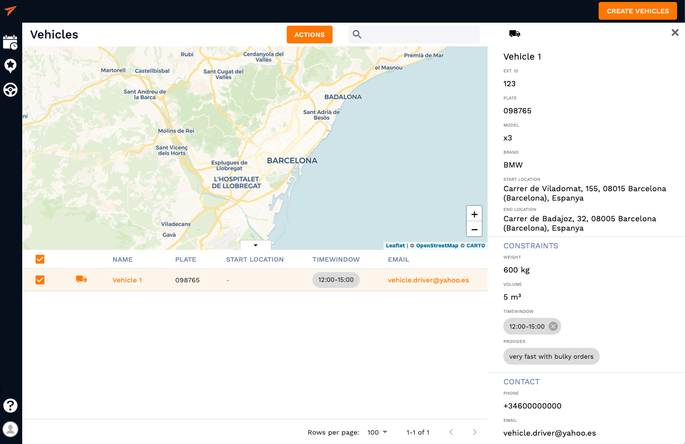

# Save vehicles

**Add your fleet information to the system for future orders and save even more time while planning**

## Essentials

This guide describes how to create, edit and save your fleet through the API. But, first of all it is necessary to provide a vehicle definition:

- **Vehicle** is a set of parameters (contact, constrains, location, plate, ...), that would represent a vehicle starting point on the map. Tasks are represented by clients.
  These tasks must be assigned to someone (courier, driver, ...) that would be operating the vehicles we're saving in the system,formerly called **Route**.

<!-- tabs:start -->
#### ** Customer **

##  Add a vehicle

To add a vehicle you have to enter the **Plans** section or the **Vehicles** section. 
Saving clients can be as easy as right-clicking a map at clients address and a pop-up will suggest to save this address as a new service which can be assigned throught client or a vehicle as well as through a button in the top right corner. 

The vehicle information that you can save includes vehicles start and end location, external identifier, plate number, constrains and contact information. The profile of a client should look something like this:

You can specify a wide range of constrains which include **volume, weight, time windows, usual delivery duration and even requirements field where you can leave a note for convinience**. Also, vehicles can be pin-pointed on the map with different icons representing a vehicle type in order to locate them on the map faster. Just left-click the default truck icon to change its appearance. 

Vehicles can be added manually by clicking the "Create Vehicles" button (1) and then after the input has been done by hitting "Create" button (2) or can be imported from an excel sheet which will be explained step-by-step in the [uploading a spreadsheet](/vehicles/uploading_excel.md) section. 

#### ** Developer **

<!-- tabs:end -->

## See also

This guide provides a Quickstart in the vehicles module. Now you know how to create a vehicles and how to add all the required constrains to match it with services and routes in a most efficient way.
But, why stopping here? The best part is about to come.

- [Uploading a spreadsheet]()
- [Using multiple sheets]()

