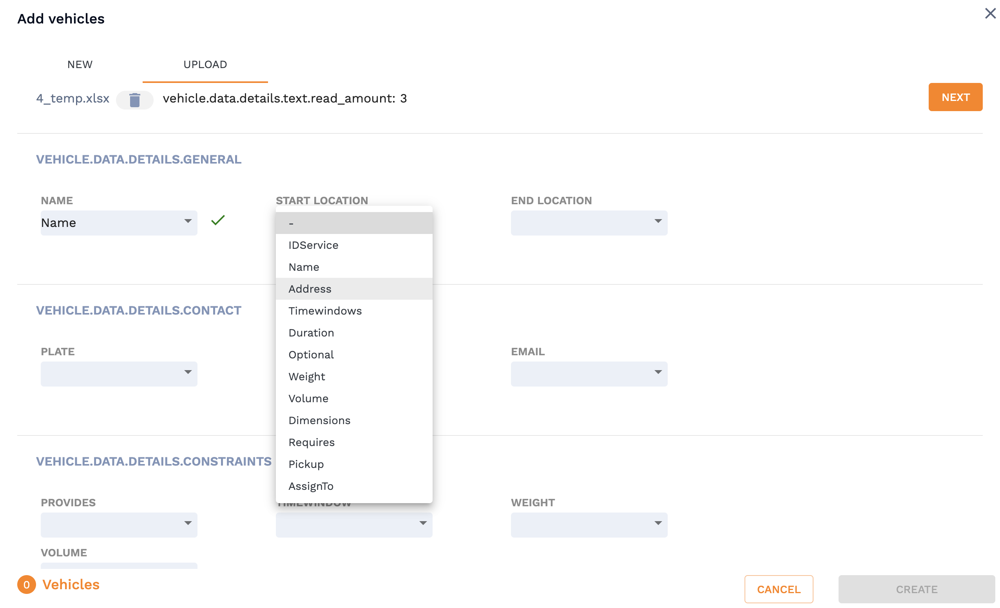
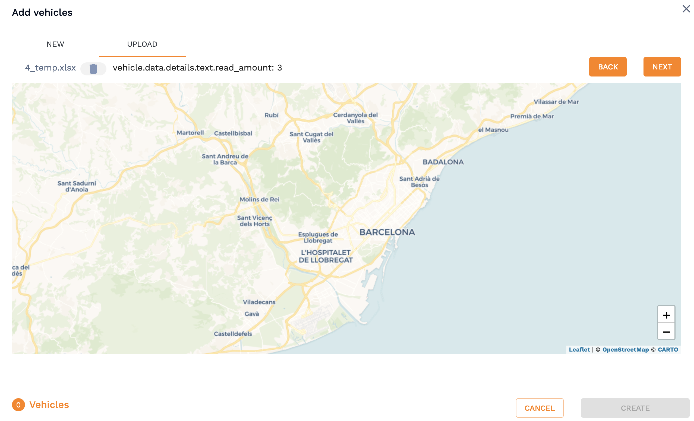
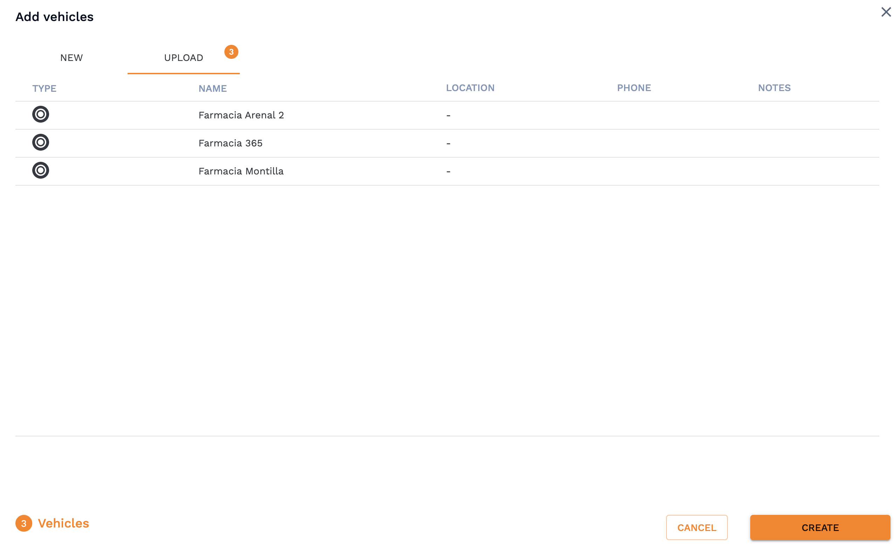
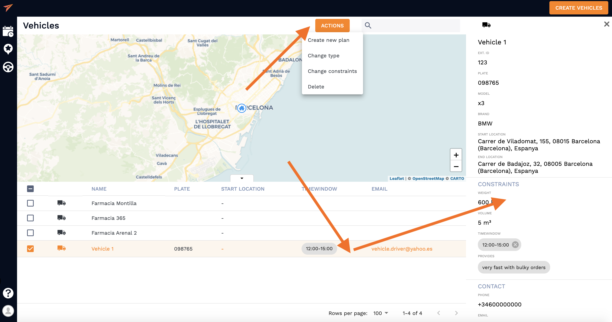

# Upload an excel sheet with you operations 

**Import your vehicles from an shreadsheet just in few moments**

<!-- tabs:start -->
#### ** Customer **

## 1. Uploading an excel sheet 

To start uploading vehicles from a spreadsheet navigate to "Upload" bar in the "Create Vehicles" section, choose a file and upload it. Once the file is uploaded next thing to do is to **allow the columns with the vehicle information you have in your spreadsheet to be read by the system**. You need to choose the relevant parameters in the drop-down menu that would match the column names in your excel sheet. In the example below, we only wanted to import address and name of the vehicle:

Click "Next" button to continue after picking all the parameters. 

## 2. Map your vehicles

Next, you will see a map layout with all the saved vehicle start locations which will look something like this:  

Click "Next" button to continue the upload. 

**NOTE**: It will look like this if all read locations are relatively close, more further locations will make the map zoom out to capture all the locations

## 3. Check the data 

Before final vehicle upload to the system you can view the information one last time in a form of a list to check if your excel was read properly. If that's the case - hit "Create" button and you're almost there. 

## 4. Make any adjustment if needed

The vehicles have been successfully uploaded and now you can adjust the vehicle list as you want. You can check the vehicles you want to do same actions with and hit "Actions" button at the top of the nativation bar and choose what needs to be done to all of them. Also, you can click on any particular vehicle and manually change information in its profile. 

Vehicle icons appearance can be adjusted in order to specify the type of vehicle or courier which is explained in section [adding a vehicle](/vehicles/creating_vehicles.md). 

#### ** Developer **

<!-- tabs:end -->

## See also

This guide provides a Quickstart in the vehicles module. Now you know how to save a vehicle and how to add all the required constrains to match it with services and routes in a most efficient way.
But, why stopping here? The best part is about to come.

- [Adding a vehicle]()